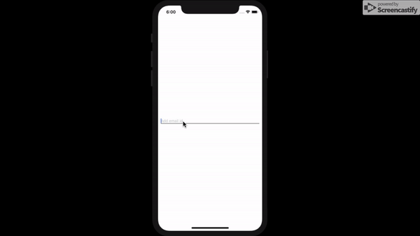

# react-native-email-chip
A simple and customizable React Native component that implements email chips. 
## Demo
  
## Installation
  ```
  npm install react-native-email-chip
  ```
## Example
```
import EmailChip from 'react-native-email-chip';
...
onChange = (emails) => {
  this.setState({ emails })
}
...
 <EmailChip
    emails={this.state.emails}
    onChange={this.onChange}
    // chipContainerStyle={{backgroundColor:'white'}}
    // invalidChipContainerStyle={{backgroundColor:'red'}}
    // chipTextStyle={{color:'#000'}}
    // invalidChipTextStyle = {{color: 'white'}}
    // textInputStyles={{borderBottomWidth: 0}}
  />
```
## Props
| Prop          | Description   | Type   | Default |
| :-----------: |:-------------:| :-----:| :-----: |
| `emails`      | An array of email chips to be displayed  | Array | **Required** |
|   `**onChange**`   | A handler to be called when array of email chips change.      |   Function | **Required** |
| `chipContainerStyle` | Styling override for container surrounding chip  |    Object | {{backgroundColor: '#d2d5dd'}} |
| `invalidChipContainerStyle` | Styling override for container surrounding invalid chip  |    Object | {{backgroundColor: '#CC2D22'}} |
| `chipTextStyle` | Styling override for chip text | Object | {{color: 'black'}} |
| `invalidChipTextStyle` | Styling override for invalid chip text | Object | {{color: 'white'}} |
| `textInputStyles` | Styling override for textinput | Object | {{borderBottomWidth : 1}}


